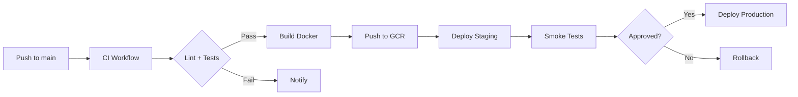

# SalonOS - AI-Native Salon Revenue Operating System

[](https://github.com/Akram0307/jh-salon-twin/actions/workflows/ci.yml)
[](https://github.com/Akram0307/jh-salon-twin/actions/workflows/deploy.yml)
[](https://github.com/Akram0307/jh-salon-twin/actions/workflows/e2e.yml)

> **Production-Ready** AI-native salon management platform with Owner HQ, Staff Workspace, and Client PWA.

## 🎯 Project Overview

SalonOS is a comprehensive salon revenue operating system featuring:

| Component | Technology | Purpose |
|-----------|------------|----------|
| **Owner HQ** | Next.js 14 + PWA | Control tower for salon operations |
| **Staff Workspace** | Vite + React | Staff scheduling and task management |
| **Client PWA** | Vite + React | Client booking and engagement |
| **Backend API** | Express.js + TypeScript | Core business logic, AI services, CRM |
| **Database** | PostgreSQL + Redis | Persistent storage and caching |

### Key Capabilities

- 📅 **Smart Scheduling** - Drag-drop calendar with AI demand forecasting
- 💰 **POS & Transactions** - Point-of-sale with revenue tracking
- 📊 **Analytics Dashboard** - Real-time KPIs and business insights
- 🤖 **AI Integration** - Gemini 2.0 Flash for automation via OpenRouter
- 💬 **Communications** - Twilio SMS/WhatsApp integration
- 🔐 **Role-Based Access** - Owner, Manager, Staff, Client roles

---

## 🏗️ Architecture

```
┌─────────────────────────────────────────────────────────────────┐
│                        Google Cloud Platform                     │
├─────────────────────────────────────────────────────────────────┤
│  ┌─────────────┐    ┌─────────────┐    ┌─────────────────────┐   │
│  │ Cloud Run   │    │ Cloud Run   │    │    Cloud SQL        │   │
│  │ Owner HQ    │◄──►│ Backend API │◄──►│    (PostgreSQL)     │   │
│  │ (Next.js)  │    │ (Express)   │    └─────────────────────┘   │
│  └─────────────┘    └──────┬──────┘           ▲                 │
│                            │                  │                 │
│                            ▼                  │                 │
│                     ┌─────────────┐            │                 │
│                     │    Redis    │◄───────────┘                 │
│                     │   (Cache)   │                              │
│                     └─────────────┘                              │
├─────────────────────────────────────────────────────────────────┤
│  External Services:                                              │
│  • OpenRouter (AI/Gemini)  • Twilio (SMS/WhatsApp)              │
│  • GCP Secret Manager      • GCP Container Registry              │
└─────────────────────────────────────────────────────────────────┘

┌─────────────────────────────────────────────────────────────────┐
│                      Client Applications                         │
├─────────────────────────────────────────────────────────────────┤
│  ┌─────────────┐    ┌─────────────┐    ┌─────────────────────┐ │
│  │ Owner HQ    │    │ Staff WS    │    │ Client PWA          │ │
│  │ (Desktop)   │    │ (Tablet)    │    │ (Mobile)            │ │
│  │             │    │             │    │                     │ │
│  │ Dashboard   │    │ Schedule    │    │ Book Appointments   │ │
│  │ Reports     │    │ Tasks       │    │ View Bookings       │ │
│  │ Clients     │    │ Check-in    │    │ AI Assistant        │ │
│  │ POS         │    │ Client List │    │ Waitlist            │ │
│  └─────────────┘    └─────────────┘    └─────────────────────┘ │
└─────────────────────────────────────────────────────────────────┘
```

---

## 📁 Repository Structure

```
jh-salon-twin/
├── backend/                    # Express.js API server
│   ├── src/
│   │   ├── routes/            # 49 API route files
│   │   ├── services/          # 66 business logic services
│   │   ├── repositories/      # 25 data access layer
│   │   ├── schemas/           # Zod validation schemas
│   │   ├── middleware/        # Auth, rate limiting, logging
│   │   ├── agents/           # AI agent implementations
│   │   ├── config/           # Configuration (secrets via GCP)
│   │   └── webhooks/         # Twilio webhook handlers
│   ├── scripts/              # Database seeding, verification
│   ├── db/                   # dbmate migrations
│   └── Dockerfile
│
├── frontend-next/             # Owner HQ (Next.js 14 PWA)
│   ├── src/
│   │   ├── app/              # App Router pages
│   │   ├── components/       # React components (117 total)
│   │   ├── hooks/           # Custom React hooks
│   │   ├── lib/             # Utilities, API client
│   │   ├── store/           # Zustand state management
│   │   └── types/           # TypeScript definitions
│   └── ...
│
├── frontend/                  # Staff Workspace + Client PWA
│   ├── src/
│   │   ├── components/       # Shared UI components
│   │   ├── pages/            # Vite routes
│   │   ├── staff/           # Staff workspace features
│   │   └── client/          # Client PWA features
│   └── ...
│
├── e2e/                       # Playwright E2E test suite
│   ├── tests/
│   │   ├── login.spec.ts
│   │   ├── dashboard.spec.ts
│   │   ├── booking.spec.ts
│   │   ├── pos.spec.ts
│   │   ├── drag-drop-scheduling.spec.ts
│   │   ├── bulk-operations.spec.ts
│   │   ├── command-palette.spec.ts
│   │   └── visual-comparison.spec.ts
│   └── playwright.config.ts
│
├── db/                        # Database migrations
│   ├── migrations/           # dbmate SQL migrations
│   └── schema.sql            # Full schema reference
│
├── .github/
│   └── workflows/            # 12 CI/CD workflows
│
└── scripts/                   # Deployment & maintenance scripts
```

---

## 🌐 API Reference

### Base URLs

| Environment | Backend API | Frontend |
|-------------|-------------|----------|
| **Production** | `https://salonos-backend-prod-*.a.run.app` | `https://salonos-owner-frontend-prod-*.a.run.app` |
| **Staging** | `https://salonos-backend-*.a.run.app` | `https://salonos-owner-frontend-*.a.run.app` |

### Core Endpoints

#### Authentication
```
POST /api/auth/register        # Register new user
POST /api/auth/login           # Login (returns JWT)
POST /api/auth/refresh          # Refresh access token
POST /api/auth/logout          # Invalidate refresh token
GET  /api/auth/me              # Get current user
```

#### Appointments
```
GET    /api/appointments        # List appointments
POST   /api/appointments        # Create appointment
GET    /api/appointments/:id    # Get appointment
PUT    /api/appointments/:id    # Update appointment
DELETE /api/appointments/:id    # Cancel appointment
POST   /api/appointments/:id/check-in  # Staff check-in
```

#### Clients
```
GET    /api/clients             # List clients
POST   /api/clients             # Create client
GET    /api/clients/:id         # Get client details
PUT    /api/clients/:id         # Update client
DELETE /api/clients/:id         # Delete client
GET    /api/clients/:id/history # Appointment history
```

#### Staff
```
GET    /api/staff               # List staff members
POST   /api/staff               # Add staff member
GET    /api/staff/:id           # Get staff details
PUT    /api/staff/:id           # Update staff
DELETE /api/staff/:id           # Remove staff
GET    /api/staff/:id/schedule  # Staff schedule
PUT    /api/staff/:id/availability  # Update availability
```

#### Services
```
GET    /api/services            # List salon services
POST   /api/services            # Create service
GET    /api/services/:id        # Get service details
PUT    /api/services/:id        # Update service
DELETE /api/services/:id        # Delete service
```

#### POS & Transactions
```
POST   /api/pos/create-session    # Create POS session
POST   /api/pos/add-item          # Add item to transaction
POST   /api/pos/complete          # Complete transaction
GET    /api/transactions          # List transactions
GET    /api/transactions/:id      # Transaction details
```

#### Waitlist
```
GET    /api/waitlist              # Get waitlist
POST   /api/waitlist              # Add to waitlist
PUT    /api/waitlist/:id          # Update waitlist entry
DELETE /api/waitlist/:id          # Remove from waitlist
```

#### AI Services
```
POST   /api/ai/chat               # AI chat assistant
POST   /api/ai/demand-forecast    # Demand forecasting
POST   /api/ai/revenue-insights  # Revenue analysis
POST   /api/ai/recommendations   # Service recommendations
```

#### Webhooks
```
POST   /webhooks/twilio/sms       # Twilio SMS webhook
POST   /webhooks/twilio/whatsapp  # WhatsApp webhook
```

### Health Check
```
GET /health                       # Backend health status
GET /api/health                   # Detailed health with DB/Redis
```

---

## 🔐 Security

### Authentication Flow
1. Client → `POST /api/auth/login` with credentials
2. Server → Returns `accessToken` (15min) + `refreshToken` (7 days)
3. Client → Uses `accessToken` in `Authorization: Bearer <token>`
4. Expired token → `POST /api/auth/refresh` with refresh token

### JWT Secret Management
```typescript
// backend/src/config/secrets.ts
// JWT secrets loaded from GCP Secret Manager with fail-fast validation
const JWT_SECRET = await secretManager.getSecret('salonos-jwt-secret');
if (!JWT_SECRET) throw new Error('JWT_SECRET not configured');
```

### Required Secrets (via GCP Secret Manager)
| Secret Name | Purpose |
|-------------|----------|
| `salonos-jwt-secret` | JWT access token signing |
| `salonos-refresh-secret` | Refresh token signing |
| `salonos-db-password` | PostgreSQL password |
| `salonos-openrouter-key` | AI API key |
| `salonos-twilio-credentials` | Twilio SID/Token |

### Rate Limiting
- **In-memory rate limiter** (note: bypassed in multi-instance Cloud Run)
- **Recommended:** External Redis-based rate limiting for production

---

## 🚀 Deployment

### Environments

| Environment | Trigger | URL |
|-------------|----------|-----|
| **Staging** | Push to `main` | Auto-deploys |
| **Production** | Manual workflow dispatch | Requires approval |

### Deployment Pipeline



### Manual Deployment

```bash
# Frontend to Cloud Run
./scripts/deploy_frontend_next_cloudrun.sh

# Backend to Cloud Run
./scripts/redeploy_backend_cloudrun.sh

# Sync after successful deployment
git add . && git commit -m "chore: sync successful GCP deployment"
./scripts/release_after_gcp_success.sh v1.x.x
```

### Database Migrations

```bash
# Run pending migrations
cd backend
npx dbmate migrate

# Or via SQL directly
psql "$DATABASE_URL" -f db/migrations/*.sql
```

---

## 📋 GitHub Workflows

| Workflow | Purpose | Trigger |
|----------|---------|----------|
| `ci.yml` | Lint, type check, unit tests | Push/PR |
| `deploy.yml` | Full stack deploy | Push main |
| `e2e.yml` | Playwright E2E tests | Push/PR/manual |
| `codeql.yml` | Security analysis | Push main |
| `lighthouse.yml` | Performance budgets | Push/PR |
| `visual-regression.yml` | Screenshot comparison | Weekly/manual |
| `deploy-backend.yml` | Backend-only deploy | Manual |
| `deploy-client-pwa.yml` | Client PWA deploy | Manual |
| `deploy-infra.yml` | Infrastructure setup | Manual |
| `monitor.yml` | Health monitoring | Schedule |
| `security-scan.yml` | Vulnerability scan | Weekly |
| `dependency-update.yml` | Dependabot config | Auto |

---

## 🧪 Testing

### E2E Test Suite (Playwright)

```bash
cd e2e

# Install browsers
npx playwright install chromium

# Run all tests
npx playwright test

# Run specific spec
npx playwright test tests/login.spec.ts

# Run with UI
npx playwright test --ui

# Mobile viewport
npx playwright test --project=mobile
```

### Test Coverage

| Category | Files | Coverage |
|----------|-------|----------|
| Backend unit tests | `backend/src/__tests__/` | ~82% |
| E2E specs | `e2e/tests/` | 13 specs |
| Visual regression | `e2e/screenshots/` | Baseline tracked |

---

## 🔧 Development

### Prerequisites
- Node.js 20+
- PostgreSQL 14+
- Redis 7+
- Docker (for containerized dev)

### Local Setup

```bash
# Clone repository
git clone https://github.com/Akram0307/jh-salon-twin.git
cd jh-salon-twin

# Backend
cd backend
cp .env.example .env  # Fill in values
npm install
npm run dev

# Frontend (separate terminal)
cd frontend-next
npm install
npm run dev

# Client PWA (separate terminal)
cd frontend
npm install
npm run dev
```

### Environment Variables

```bash
# backend/.env (DO NOT COMMIT)
PORT=3000
DB_HOST=localhost
DB_PORT=5432
DB_USER=salon_admin
DB_PASSWORD=<your-password>
DB_NAME=postgres

# GCP Secret Manager for production
JWT_SECRET=<from-gcp-secret-manager>
REFRESH_TOKEN_SECRET=<from-gcp-secret-manager>

# External APIs
OPENROUTER_API_KEY=<your-key>
TWILIO_ACCOUNT_SID=<your-sid>
TWILIO_AUTH_TOKEN=<your-token>
```

---

## 🐛 Troubleshooting

### Backend Won't Start
```bash
# Check database connectivity
psql "postgresql://$DB_USER:$DB_PASSWORD@$DB_HOST:$DB_PORT/$DB_NAME" -c "SELECT 1"

# Check Redis
redis-cli ping

# View logs
tail -f backend/server.log
```

### Frontend Build Failures
```bash
# Clear Next.js cache
cd frontend-next && rm -rf .next && npm run build

# Check API base URL
echo $NEXT_PUBLIC_API_BASE_URL
```

### Cloud Run Deployment Issues
```bash
# Check service status
gcloud run services describe salonos-backend --region=us-central1

# View logs
gcloud run services logs read salonos-backend --region=us-central1 --limit=50

# Verify container
gcloud artifacts docker images list gcr.io/$PROJECT_ID/salonos-backend
```

### Database Connection
```bash
# Test TCP handshake
node backend/scripts/test_tcp_handshake.js

# Run with cloud-sql-proxy
cloud-sql-proxy --port 5432 $INSTANCE_CONNECTION_NAME
```

---

## 📊 Monitoring

### Health Endpoints
```bash
# Backend health
curl https://salonos-backend-*.a.run.app/health

# Frontend
curl https://salonos-owner-frontend-*.a.run.app/
```

### Logs
```bash
# Real-time backend logs
gcloud run services logs read salonos-backend --region=us-central1 --follow

# Real-time frontend logs
gcloud run services logs read salonos-owner-frontend --region=us-central1 --follow
```

---

## 🤝 Contributing

1. **Fork** the repository
2. **Create** a feature branch (`git checkout -b feature/amazing-feature`)
3. **Commit** your changes with clear messages
4. **Push** to your fork
5. **Open** a Pull Request with description

### Code Standards
- TypeScript strict mode enabled
- ESLint + Prettier for formatting
- Zod schemas for all API inputs
- Unit tests for new services
- Update README if adding endpoints

---

## 📝 AI Agent Instructions

This section helps AI agents understand how to work with SalonOS:

### Common Tasks

**Deploy Backend:**
```bash
cd /a0/usr/projects/jh_salon_twin
./scripts/redeploy_backend_cloudrun.sh
```

**Deploy Frontend:**
```bash
cd /a0/usr/projects/jh_salon_twin
./scripts/deploy_frontend_next_cloudrun.sh
```

**Run Database Migration:**
```bash
cd /a0/usr/projects/jh_salon_twin/backend
npx dbmate migrate
```

**Run E2E Tests:**
```bash
cd /a0/usr/projects/jh_salon_twin/e2e
npx playwright test --project=chromium
```

**Sync to GitHub:**
```bash
cd /a0/usr/projects/jh_salon_twin
./scripts/git_sync_after_gcp_success.sh "chore: deployment sync"
```

### Key Files for AI Agents

| File | Purpose |
|------|---------|
| `backend/src/config/secrets.ts` | Secret loading logic |
| `backend/src/routes/` | All API endpoints |
| `frontend-next/src/app/` | Next.js pages |
| `e2e/tests/` | E2E test specs |
| `.github/workflows/` | CI/CD pipelines |
| `db/migrations/` | Database schema |

### Architecture Patterns
- **Repository Pattern:** Data access via `backend/src/repositories/`
- **Service Layer:** Business logic in `backend/src/services/`
- **Zod Validation:** All inputs validated via `backend/src/schemas/`
- **JWT Auth:** Middleware validates tokens, attaches user to `req.user`
- **Event-Driven:** Twilio webhooks post to `/webhooks/twilio/*`

---

## 📜 License

Proprietary software. All rights reserved.

---

## 📞 Support

- **Issues:** Open at https://github.com/Akram0307/jh-salon-twin/issues
- **Disaster Recovery:** See `docs/disaster-recovery-runbook.md`

---

**Last Updated:** 2026-03-19 | **Version:** 1.0.0 | **Status:** Production Ready
